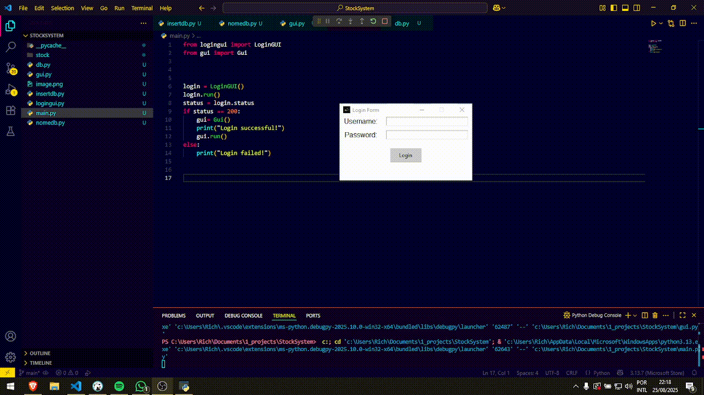

# StockSystem

Um sistema de gerenciamento de estoque feito em python com GUI(Tkinter), com vinculo a um banco de dados.

## Funcionamento(BETA)

## Funcionalidades

- Adicao e remocao de itens 
- Preview em tempo real
- Vinculado a banco de dados
- .EXE 100% interativo

